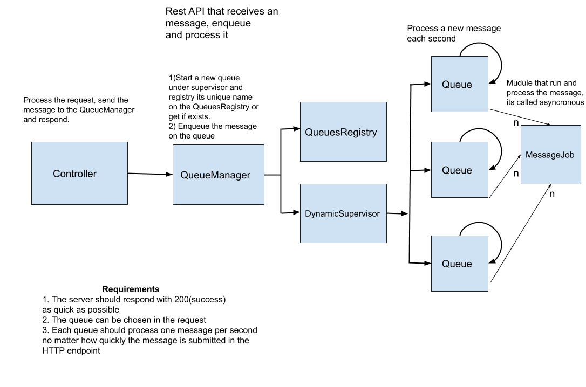

# Messaging

Messaging is an application built for test purposes, the application consists on multiples Queue(GenServer) created dynamically 
that process messages on a given `interval`.
The queues are create dynamically.

## Conceptual REST API that processes messages.



## Structure

The project consists in an umbrella APP

1. api: 
	* A regular Phoenix app with one endpoint to receive messages and delegate it to `Messaging.Core.QueueManager`(on `core` app)

2. core: The implementation of the messaging structure
 	 * `Messaging.Core.QueueManager`: A dynamic supervisor that manages(create and retrieve) the queues and delegate the messages 
     to `Messaging.Core.Queue`
	 
	 * `Messaging.Core.Queue`: Represent the processes for each `Queue`, contains the logic to process 
	 the messages(executed by `Messaging.Core.MessageJob`) on given interval(configured by `config :core, message_interval: 1000`),
	 the default interval is one second and the tests expects this config
	 
	 * `Messaging.Core.MessageJob`: Is a `Task` that process asynchronous the `message` received, its started by the `Queue`

## Requirements

* Erlang/OTP 21 [erts-10.3]+
* Elixir 1.11.1+ (compiled with OTP 21)

## Setup / Development

1. Install dependencies

```shell
$ mix deps.get
```

2. Run application

```shell
$ mix phx.server
```

3. Application are running on localhost:4000


## Tests

1. Run mix tests

```shell
$ mix test
```

2. After the setup you can test it manually calling the endpoint:

```
http://localhost:4000/receive-message?queue=my_queue&message=my_msg
or
curl -v http://localhost:4000/receive-message?queue=queue&message=message
```
## Samples

1. Create 1000 messages samples stressing the server by 1k requests with a concurrency factor of 30
```shell
$ mix phx.server
```
2. on another shell
```shell
$ mix samples
```

## Static code analysis

```shell
$ mix credo --strict
```

## How to guarantee that messages are being processed on the given interval?

1. The tests on `Messaging.CoreTest` guarantee that, that messages are `assert_receive` are received on given `interval`

2. You can manually see the logs time

```
$ iex -S mix

iex(1)> alias Messaging.Core.QueueManager
iex(2)> for i <- 1..5 do                                                      
...(2)> QueueManager.enqueue "Queue 1", "Hello World #{i}"                    
...(2)> QueueManager.enqueue "Queue 2", "Hello World #{i}"
...(2)> end
[:ok, :ok, :ok, :ok, :ok]
2019-05-01 18:10:36.891 [info] MessageJob - Queue: queue_Queue 2 -> Msg: Hello World 1
2019-05-01 18:10:36.891 [info] MessageJob - Queue: queue_Queue 1 -> Msg: Hello World 1
2019-05-01 18:10:37.892 [info] MessageJob - Queue: queue_Queue 2 -> Msg: Hello World 2
2019-05-01 18:10:37.892 [info] MessageJob - Queue: queue_Queue 1 -> Msg: Hello World 2
2019-05-01 18:10:38.893 [info] MessageJob - Queue: queue_Queue 2 -> Msg: Hello World 3
2019-05-01 18:10:38.893 [info] MessageJob - Queue: queue_Queue 1 -> Msg: Hello World 3
2019-05-01 18:10:39.894 [info] MessageJob - Queue: queue_Queue 2 -> Msg: Hello World 4
2019-05-01 18:10:39.894 [info] MessageJob - Queue: queue_Queue 1 -> Msg: Hello World 4
2019-05-01 18:10:40.895 [info] MessageJob - Queue: queue_Queue 2 -> Msg: Hello World 5
2019-05-01 18:10:40.895 [info] MessageJob - Queue: queue_Queue 1 -> Msg: Hello World 5
```